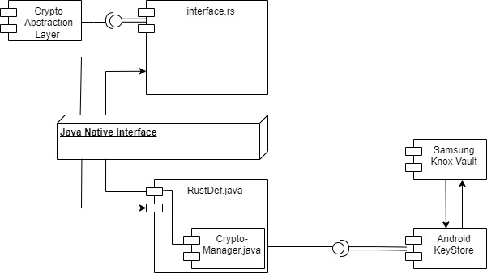

## Table of Contents

1. [Introduction](#introduction)
    - [Problem Description](#problem-description)
    - [Product Description](#product-description)
2. [Architecture](#architecture)
    - [Component Diagram](#component-diagram)
    - [Explanation](#explanation)
    - [Abstraction Layer](#abstraction-layer)
    - [Libraries](#libraries)
3. [Installation Guide](#installation-guide)
    - [Required Software](#required-software)
4. [Implementations](#implementations)
    - [Supported Devices](#supported-devices)
    - [Devices We Tested On](#devices-we-tested-on)
    - [Performance](#performance)
    - [Feature List](#feature-list)
    - [Supported Algorithms](#supported-algorithms)
    - [Out of Scope](#out-of-scope)
5. [Implementation](#implementation)
    - [Code](#code)
    - [Connection Documentation](#connection-documentation)
    - [Javadoc](#javadoc)
    - [Rustdoc](#rustdoc)
6. [Example Usage with Our Custom App](#example-usage-with-our-custom-app)
    - [Code Examples](#code-examples)
7. [Risk Management](#risk-management)
    - [Retrospective](#retrospective)
    - [Risk Identification](#risk-identification)
8. [Next Steps](#next-steps)
    - [Ideas](#ideas)
    - [What Could Be Done](#what-could-be-done)
    - [What Can Be Improved](#what-can-be-improved)
9. [Open Source Project](#open-source-project)
    - [License](#license)
    - [Issue Guide](#issue-guide)
    - [Pull Request Guide](#pull-request-guide)
10. [References](#references)
    - [Source Documents](#source-documents)
    - [Research Documents](#research-documents)

## Introduction
In today's digital era, safeguarding sensitive data on mobile devices is paramount. Our project focuses on enhancing data security by developing a wrapper for the Crypto Abstraction Layer. This wrapper enables access to a Hardware Security Module (HSM) through Samsung Knox Vault. By securely storing encryption keys within the HSM, we ensure robust protection for data stored on Samsung devices.

### Problem Description
In today's digital age, the security of data stored on mobile devices is of paramount importance. Sensitive information, whether personal or professional, is frequently stored on smartphones, making them a prime target for cyber threats. Ensuring the confidentiality, integrity, and accessibility of this data requires robust encryption and secure key management solutions.

### Product Description
Our project aims to address this critical need by developing a comprehensive solution for encrypting data stored on mobile devices. Specifically, our task is to write a wrapper for the proposed Crypto Abstraction Layer to access a specific hardware security module (HSM) on Samsung devices using Samsung Knox Vault. This solution ensures that encryption keys are securely stored and managed within the HSM, providing an added layer of security for the encrypted data.
## Architecture

### Component Diagram

### Explanation

### Abstraction Layer

### Libraries
- **Robusta**
- **JNI**
- **KeyStore API**

## Installation Guide

### Required Software
- **Android Studio**
- Additional tools and dependencies

## Implementations

### Supported Devices

### Devices We Tested On

### Performance

### Feature List

### Supported Algorithms

### Out of Scope

## Implementation

### Code

### Connection Documentation

### Javadoc

### Rustdoc

## Example Usage with Our Custom App

### Code Examples

## Risk Management

### Retrospective

### Risk Identification

## Next Steps

### Ideas

### What Could Be Done

### What Can Be Improved

## Open Source Project

### License

### Issue Guide

### Pull Request Guide

## References

### Source Documents

### Research Documents
