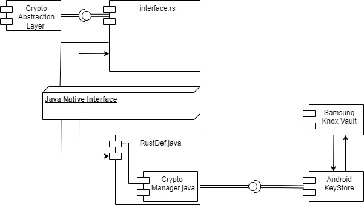

# Documentation

### Introduction
This project is part of a student development project at [Hochschule Mannheim (HSMA)](https://www.english.hs-mannheim.de/the-university.html). The project goal is provided by j&s-soft GmbH as part of their open-source project [enmeshed](https://github.com/nmshd).

### Problem Description
The enmeshed app from j&s-soft GmbH currently secures cryptographic keys in the software. This leads to security vulnerabilities and points of attack. To prevent this, hardware security modules are to be used on which the cryptographic keys are to be securely stored so that they cannot be retrieved even on compressed devices. Our team was tasked with implementing a solution to this problem in the subproject for Samsung's secure element, the Knox Vault.

### Product Description
The Repository contains a Wrapper that is used to perform cryptographic operations for mobile applications in a Secure Element (SE) on Android devices. Specifically, this project is focused on Samsung Knox Vault as the SE. The interface to the mobile application is provided in Rust, while the communication

## Table of Contents
1. [Comprehensive Overview](#comprehensive-overview)
    - [Supported Devices](#supported-devices)
    - [Devices We Tested On](#devices-we-tested-on)
    - [Performance](#performance)
    - [Feature List](#feature-list)
    - [Supported Algorithms](#supported-algorithms)
    - [Out of Scope](#out-of-scope)
2. [Installation Guide](#installation-guide)
    - [Required Software](#required-software)
3. [Usage](#usage)
    - [Code Examples](#code-examples)
4. [Architecture](#architecture)
    - [Component Diagram](#component-diagram)
    - [Explanation](#explanation)
    - [Libraries](#libraries)
5. [Implementation](#implementation)
   - [Connection Documentation](#JNI-Implementation)
    - [Javadoc](#javadoc)
    - [Rustdoc](#rustdoc)
6. [Next Steps](#next-steps)
    - [Ideas](#ideas)
    - [What Could Be Done](#what-could-be-done)
    - [What Can Be Improved](#what-can-be-improved)
7. [Open Source Project](#open-source-project)
8. [References](#references)
    - [Source Documents](#source-documents)
    - [Research Documents](#research-documents)


## Comprehensive Overview

<details open>
  <summary><strong>Supported Devices</strong></summary>

  This wrapper should work for all Android devices equiped with a SE, but the focus for our group is specifically on smartphones using Samsung Knox Vault. Therefore, testing will only be done using a Samsung smartphone, and in case there are incompatibilities between device manufacturers, Samsung will take priority. An up-to-date list of devices equipped with Knox Vault can be found [here](https://www.samsungknox.com/en/knox-platform/supported-devices) after selecting Knox Vault in the filter options. As of April 2024, the following devices are equipped with Knox Vault:

  Smartphones 
  - Samsung Galaxy A 35 / A55 
  - Samsung Galaxy S 22 / S23 / S 24
    - the plus / ultra versions as well
  - Samsung Galaxy Z Flip 3 / 4 / 5
  - Samsung Galaxy Z Fold 3 / 4 / 5
  - Samsung Galaxy X Cover 7 (Enterprise Edition) 

  Tablets 
  - Galaxy Tab S 8 / S 9
    - the plus, ultra, FE and 5G versions as well
  - Galaxy Tab Active 5 (Enterprise Edition)
    - the 5G version as well

  We have received a Samsung S22 from j&s-soft and have used this device for testing purposes througout the project.
</details>

<details open>
  <summary><strong>Performance</strong></summary>

  After an extensive performance test, we can conclude that data encryption using AES-256-CBC on the Knox Vault Chip occurs at a rate of approximately 0.11 MB/s. The test showed a variance of 0.58 s².
</details>

<details open>
  <summary><strong>Feature List</strong></summary>

  Our project supports the following features:

  - **Saving keys in the strongbox**: All generated keys are stored securely within the strongbox.
  - **Encrypt and Decrypt Data**: Utilizing symmetric encryption, our system ensures data confidentiality through encryption and decryption mechanisms.
  - **Sign and Verify Data**: We provide functionality for both symmetric and asymmetric signing and verification, ensuring data integrity and authenticity.

  In the following chapter, you will find detailed information on the supported algorithms.
</details>

<details open>
  <summary><strong>Supported Algorithms</strong></summary>

We have provided a list of the supported Algorithms of our project:

  | Algorithm Type    | Details                                      |
  |-------------------|----------------------------------------------|
  | **RSA**           | RSA;512;SHA-256;PKCS1                       |
  |                   | RSA;1024;SHA-256;PKCS1                      |
  |                   | RSA;2048;SHA-256;PKCS1                      |
  |                   | RSA;3072;SHA-256;PKCS1                      |
  |                   | RSA;4096;SHA-256;PKCS1                      |
  |                   | RSA;8192;SHA-256;PKCS1                      |
  | **ECC**           | EC;secp256r1;SHA-256                        |
  |                   | EC;secp384r1;SHA-256                        |
  |                   | EC;secp521r1;SHA-256                        |
  | **3DES**          | DESede;168;CBC;PKCS7Padding                 |
  | **AES**           | AES;128;GCM;NoPadding                       |
  |                   | AES;128;CBC;PKCS7Padding                    |
  |                   | AES;128;CTR;NoPadding                       |
  |                   | AES;192;GCM;NoPadding                       |
  |                   | AES;192;CBC;PKCS7Padding                    |
  |                   | AES;192;CTR;NoPadding                       |
  |                   | AES;256;GCM;NoPadding                       |
  |                   | AES;256;CBC;PKCS7Padding                    |
  |                   | AES;256;CTR;NoPadding                       |
</details>

<details open>
  <summary><strong>Out of Scope</strong></summary>

  In order to finish this project in the given time, we decided to mark the following as out of scope:
  - tablets
  - attestation
  - asmmetric encryption / decryption
</details>

## Installation Guide  
  
<details open>
  <summary><strong>Required Software</strong></summary> 
  
If you want to build this project on your own from the source code, these tools are necessary:  
  
- Android Studio is an IDE specifically for Android app development. While not strictly necessary, having it will make all further steps easier. This guide will assume that you are using it.  
- If you plan on modifying the Rust code, it might be smart to also have RustRover installed, since there is no Rust plugin for Android Studio.  
- RustUp is the easiest way to install Rust and Cargo. Installation is easiest from within RustRover: After starting to create a new project, there will be a button below the toolchain location selection. Pressing it will install RustUp. Alternatively you can also install RustUp directly from [their page](https://rustup.rs/).  
- You will need the Android NDK (Native Development Kit) to build and run the project. The NDK can be installed from within Android Studio: Go to Settings > Languages & Frameworks > Android SDK > SDK Tools and select and install the NDK.  
- Cargo and [cargo-ndk](https://docs.rs/crate/cargo-ndk/3.5.4) are necessary to compile the Rust code in a format usable by Android. Cargo should already be installed by RustUp, cargo-ndk can be installed with `cargo install cargo-ndk`.  
- You will need to configure cargo further by using this command: `rustup target add aarch64-linux-android armv7-linux-androideabi i686-linux-android` (The "linux" in this command refers to the phone architecture, not your development machine. You can use this command on Windows as well). This will make cargo compile your Rust code in a format suitable for Android architectures  
</details> 

<details open> 
<summary><strong>Installing Android Studio + RustRover</strong></summary>  
  
The easiest way to install both IDEs is to use the [JetBrains Toolbox](https://www.jetbrains.com/de-de/toolbox-app/), where you can install both IDEs with a single click each.  
Alternatively you can also refer to the [Android CodeLab guide](https://developer.android.com/codelabs/basic-android-kotlin-compose-install-android-studio#0), and the [RustRover download page](https://www.jetbrains.com/rust/nextversion/). After installing RustRover, you will need to install RustUp in order to compile Rust code.  
</details>

<details open>  
<summary><strong>First Test in Android Studio </strong></summary> 
  
The goal of this section is to test Android Studio and run a "Hello World"-App on a real device to confirm that the connection between the computer and phone is working. We will use a USB connection to get the app onto the device, although Wi-Fi should also be possible. This step is not strictly necessary, but eliminates a possible source of error later on.  
  
- make sure that USB debugging is enabled on the phone. Refer to [this guide](https://developer.android.com/studio/debug/dev-options) if necessary  
- install the proper driver for your smartphone on your PC / Laptop according to [this list](https://developer.android.com/studio/run/oem-usb#Drivers)  
- Open a new project in Android Studio and select Phone/Tablet on the left and use "Empty Activity" as the template  
- plug your phone into your PC / Laptop with a USB cable capable of transmitting data  
- you should be able to see your phone's storage in your file explorer  
- in Android Studio, go to "Running Devices" (on the top right by default), click on the plus sign and select your phone  
- the screen of your phone will be mirrored inside Android Studio  
- build and run your application and open it on the phone  
</details>

<details open> 
<summary><strong>Creating a project combining Rust and Java</strong></summary>

if you already have a project combining Rust and Java, you can skip this section. Otherwise, here is a quick guide for a minimal Project combining the two using [Robusta](https://github.com/giovanniberti/robusta/tree/master).

- create a new Android studio project (or use an existing one), that fits your needs for the Android/Java side of your project
- create a new folder `rust` in your project files that has the same parent folder as `app`
- Create a `Cargo.toml` file in that folder with the following content: [`Cargo.toml`](resources/Cargo.toml)
- create a `lib.rs` file in the same folder with the following content:  [`lib.rs`](resources/lib.rs)
- adjust the package marker for the `RustDef` struct in `lib.rs` on line 14 to contain the correct java package
</details>

<details open> 
<summary><strong>Integrating this Repo into your project</strong></summary>
	
- fork this Repo and integrate it into the project you created as a submodule. This can be done with
	```
	git submodule add <Link to your forked Repo>
	git submodlue update --init --recursive
	```
- The two files `CryptoManager.java` and `RustDef.java` in [`src/tpm/android/knox/java`](https://github.com/cep-sose2024/rust-crypto-knox/tree/main/src/tpm/android/knox/java) will need to be moved to the other Java files in your project. By default, this is something like `src/main/java/com/example/example_project`.
- Adjust the `const CLASS_SIGNATURE`  in [`src/tpm/android/knox/interface.rs`](https://github.com/cep-sose2024/rust-crypto-knox/blob/main/src/tpm/android/knox/interface.rs) to match the package that you put `RustDef.java` into. For the example above, that would be `const CLASS_SIGNATURE: &str = "com/example/example_project/RustDef";`  
</details>

<details open>
<summary><strong>Building and running the project</strong></summary>
  
Now you are ready to compile everything. The following command will compile all your Rust code into a dynamic library (`.so`) that can be used by your android app. You will need to run this command within your `rust` folder
  
    cargo ndk -t armeabi-v7a -t arm64-v8a -o ../app/src/main/jniLibs build  
  
After completing that step, check the directory specified in the command (`app/src/main/jniLibs` in this example). You should find two files `libexampleproject.so` in a sub directory. If so, then the last step was successful. Now you will  need to adjust which library Java is looking for. This can be found in `RustDef.java` in line 57.  Set the string there to the same as the name of your package in the `rust/Cargo.toml` that you created for your main project.
  
Afterward, you can compile your Java code. You will need to specify the location that the compiled Rust library is in.  The easiest way to do that is by specifying the library path when running gradle like this:  
  
    .\gradlew -D java.library.path=app/src/main/jniLibs installDebug  
  
With that, you should have everything complete and compiled the project from scratch.  
</details>

## Usage
<details open>
  <summary><strong>Knox config</strong></summary> 

 
</details>

## Architecture
<details open>
  <summary><strong>Component Diagram</strong></summary> 


</details>

<details open>
<summary><strong>Components</strong></summary> 

The component diagram illustrates the relationships and interactions between the different classes and modules of the project. Here are the main components:

- **CryptoManager**:
The `CryptoManager` class handles cryptographic operations within the Android environment. It provides functions for generating and storing symmetric and asymmetric keys in the Android Keystore, as well as for encrypting and decrypting data. Additionally, it enables signing and verifying data using keys stored in the Keystore.


- **RustDef**: 
The `RustDef` class defines the interface to the cryptographic functions implemented in Rust. It loads the native library and declares the native methods implemented in Rust.


- **interface.rs**:
This module contains the implementation of cryptographic functions in Rust and exposes them to the Java environment. The functions in `interface.rs` are designed to perform cryptographic operations efficiently and securely, providing an interface for use in Android applications.
</details>

<details open>
<summary><strong>Libraries</strong></summary> 

- #### JNI

The Java Native Interface (JNI) is a foreign-function interface (FFI) that supports
cross-communication between Java and native languages such as C or Rust. We use it to
communicate between the Rust- and Java parts of the wrapper by calling Java methods from
the Rust environment and passing parameters that way. The JNI is provided by Oracle and tied directly into the JDK.
To find out more about how the exact communication works, check the [JNI Implementation](#JNI-Implementation).
- **KeyStore API**

The [Android Keystore system](https://developer.android.com/privacy-and-security/keystore) handles the cryptographic keys for us. We went with this over the Knox SDK because it's a better fit for our needs, and even Samsung recommends it in their [Knox Vault Whitepaper](https://image-us.samsung.com/SamsungUS/samsungbusiness/solutions/topics/iot/071421/Knox-Whitepaper-v1.5-20210709.pdf). After more research, it also seemed like the best way to achieve the project goal in the limited time we had.

With the Keystore and other APIs, we can use the keys to encrypt and decrypt data, as well as sign and verify it. The API also helps us solve the problem from j&s-soft, as we can enforce generated cryptographic keys to be saved in the Knox Vault (or any other strongbox).

The Knox Vault doesn't support all the cryptographic algorithms enabled by the Keystore and other APIs. As we couldn't find any detailed documentation about what the Knox Vault supports, we had to test it out by trial and error. You can see all the algorithms that have passed our tests in the [Supported Algorithms](#supported-algorithms) section.

You can find out more about the KeyStore API and other APIs that are normally used with it in the following repository: [Android-Security-Reference](https://github.com/doridori/Android-Security-Reference/blob/master/framework/keystore.md). It also has some useful general info about security on Android.
</details>

## Implementation
<details open>
<summary><strong>JNI-Implementation</strong></summary> 

The basic premise of our JNI connection is to have a `JavaVM` passed to the Rust Code. With this reference we are able
to call methods provided by the [JNI crate](https://crates.io/crates/jni). Those allow us to call Java functions and
pass parameters to them and receive return values and Java exceptions.

In order to aid type conversion, we are currently using Robusta as a wrapper around the JNI, but we are only using
functionality that is provided by the JNI itself, in order to make a future conversion to pure JNI easier.

From the `JavaVM` that is passed in the `KnoxConfig` struct we are able to obtain a `JNIEnv`. For us the most important
method provided by this is this method:

```
call_static_method(&self,
 class: T,
 name: U,
 sig: V,
 args: &[JValue]) 
-> Result<JValue>
```

This method gets the class definition with the full package name,
the name of the method in the class,
a signature of the parameters used by the method,
and finally the parameters themselves as JValues.

The class and method name can be determined manually, but the signature should always be automatically generated. To do
this, call the following command on the commandline:

    javap -s -p path/to/the/java/file.class

with the compiled `.class` file. This will print all method signatures to the command line, including the name and the
parameter signature needed for `sig`.

The conversion of your parameters to JValues can be done through `JValue::from(<xyz>)` most of the time.

The method returns a JValue containing the return type of the Java method that needs to be converted back to Rust data
types. If a Java exception is thrown, the method returns an Error.

Example:

    call_static_method(  
    "com/example/vulcans_limes/RustDef",  
    "create_key",  
    "(Ljava/lang/String;Ljava/lang/String;)V",  
    &[JValue::from(jnienv.new_string(key_id).unwrap()),  
      JValue::from(jnienv.new_string(key_gen_info).unwrap())]);
</details>

<details open>
<summary><strong>Javadoc</strong></summary> 
	
All used Java code is documented [here](JavaDoc/index.html)

</details>

<details open>
<summary><strong>Rustdoc</strong></summary> 
	
All used Rust code is documented [here](RustDoc/crypto_layer/index.html)

</details>


## Next Steps
This chapter is all about looking to the future and thinking about how we can take this project in new directions.
<details open>
<summary><strong>Ideas for our wrapper</strong></summary> 
	
- Check out how many keys the Knox Vault can store and document the result, as apparently the Keystore API does not limit how many keys can be stored. This theoretically means the only limit is the available data storage the Vault has for keys.
- Improve the encrypt and decrypt methods so they can use asymmetric keys. 
- Implement a modular key usage handling system. The system should take the information about the key usages when the key gets created, and create it with these specific purposes (e.g. encrypt, decrypt, sign, verify, key lifetime, limited key usages)
- Have a broader spectrum of devices to test on. Knox Vault should technically not be different on the current devices, though in the future that might change. Newer security modules might provide more cryptographic algorithms or performance in the future.
- Obtain a reference to the JavaVM without having to pass it to the crypto layer.
</details>

<details open>
<summary><strong>Ideas for the crypto layer</strong></summary> 
	
- As the security modules are not built on performance, they take some time to encrypt and decrypt data. So creating derived keys for encryption and decryption outside of the security module will speed this process up immensely. The drawback however, could be security vulnerability.
- Implementing some kind of attestation, if possible, so the enmeshed app knows its communicating with a security module, and which security module. (e.g. for our case the Google attestation service)
- A method that lists and returns all the capabilities/supported algorithms the wrapper and security module provide.
- a method that returns metadata about the loaded key like usages, algorithm, etc.
</details>


## Open Source Project

<details open>
<summary><strong>License</strong></summary> 

MIT License
[LICENSE](https://github.com/cep-sose2024/rust-crypto-knox/blob/4989f3eb36552537e00fe58cbd29fa95312a6892/LICENSE)
</details>

<details open>
<summary><strong>Contribution Guide</strong></summary>

[Contribution](https://github.com/nmshd/.github/tree/main)

</details>


## References
<details open>
<summary><strong>Source Documents</strong></summary> 

  [Samsung Knox Whitepaper](https://image-us.samsung.com/SamsungUS/samsungbusiness/solutions/topics/iot/071421/Knox-Whitepaper-v1.5-20210709.pdf): Hold information about Samsung Knox, but also about the Knox Vault feature.
  
  [Android Keystore system](https://developer.android.com/privacy-and-security/keystore): Holds information about the Keystore system, how to use the Android keystore, as well as leading to other Android developer documents.
  
  [Robusta](https://github.com/giovanniberti/robusta/tree/master): The library we use for easier communication between Rust and Java.
  
  [Java Native Interface (JNI)](https://docs.oracle.com/javase/8/docs/technotes/guides/jni/): Needed for the communication between Rust and Java, Robusta makes using this interface easier for us.
  
</details>

<details open>
<summary><strong>Research Documents</strong></summary> 

</details>

<details open>
<summary><strong>Further reading</strong></summary> 
	
[j&s-soft GmbH](https://www.js-soft.com/en/)

[enmeshed](https://github.com/nmshd)

[Hochschule Mannheim (HSMA)](https://www.english.hs-mannheim.de/the-university.html)

</details>


