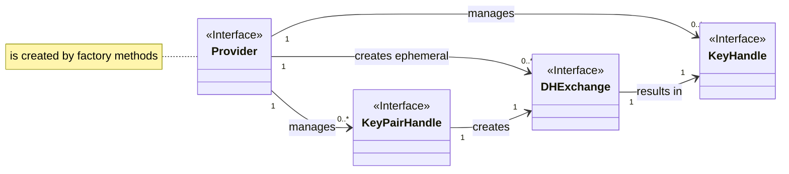

<div align="center">

# Crypto Layer

</div>

> [!WARNING]
> Work in Progress

> [!WARNING]
> Might not compile on `x86_64-pc-windows-gnu`.

Crypto Layer is a comprehensive and flexible cryptographic library designed to provide a unified interface for various cryptographic operations and algorithms.
It offers a wide range of functionalities, including encryption, decryption, signing, signature verification, and hashing, while supporting both symmetric and asymmetric cryptography.


## Features

- **Encryption Algorithms**: Supports a variety of encryption algorithms, including:

  - Asymmetric Encryption: RSA, ECC (Elliptic Curve Cryptography) with various curve types (P-256, P-384, P-521, secp256k1, Brainpool curves, Curve25519, Curve448, FRP256v1)
  - Symmetric Block Ciphers: AES (GCM, CBC)
  - Stream Ciphers: ChaCha20, XChaCha20


- **Hashing Algorithms**: Supports a wide range of hashing algorithms, including:

  - SHA-2 (SHA-224, SHA-256, SHA-384, SHA-512, SHA-512/224, SHA-512/256)
  - SHA-3 (SHA3-224, SHA3-256, SHA3-384, SHA3-512)


- **Key Management**: Provides a unified interface for creating, loading, and managing cryptographic keys, supporting various key usages and algorithms.

- **Cross-Platform Support**: Designed to work seamlessly across multiple platforms, including Android, Apple, Linux and Windows, with platform-specific implementations for key handling and security module integration.

- **Security Module Integration**: Integrates with Hardware Security Modules (HSMs) and Trusted Platform Modules (TPMs) for secure key storage and cryptographic operations, ensuring enhanced security and compliance with industry standards.

- **Extensibility**: The modular design of the Crypto Layer allows for easy extension and integration of additional cryptographic algorithms and security modules in the future.


## Usage

### Usage Rust Crate

Add the library via `cargo` to your project:
```
cargo add https://github.com/nmshd/rust-crypto
```

#### Examples

Examples for the rust crate can be found in the [example folder](./examples/).


### [Usage Flutter Plugin](./flutter_plugin/README.md)

### [Example Flutter App integration](./flutter_app/README.md)

### [Usage NodeJS Plugin](./node-plugin/README.md)


## Design

### Overview

- **Providers** are interfaces to native implemented secure storages like TPM, HSM, NKS and the fallback software provider.
- **Key Pair Handles** are interfaces for interacting and operating with a native key pair (P256).
- **Key Handles** are interfaces for interacting and operating with a native symmetric keys (AES).
- **DH Exchanges** are interfaces for executing a DH key exchange.

```mermaid
architecture-beta
    group cal(material-symbols:book-outline)[Crypto Layer]
    group native(material-symbols-light:security-key-outline)[Hardware]
    group software(carbon:cics-program)[Software]

    service provider(flowbite:windows-solid)[Provider] in cal
    service androidprov(icon-park-outline:connection-arrow)[Android Provider] in cal
    service linuxprov(icon-park-outline:connection-arrow)[Linux Provider] in cal
    service windowsprov(icon-park-outline:connection-arrow)[Windows Provider] in cal
    service appleprov(icon-park-outline:connection-arrow)[Apple Provider] in cal
    service softwareprov(icon-park-outline:connection-arrow)[Software Provider] in cal

    service encrypteddb(bitcoin-icons:safe-filled)[Encrypted DB] in software
    service metadatastore(bitcoin-icons:safe-filled)[Key Metadata Storage] in software

    service android(material-symbols:android)[Strongbox Keystore] in native
    service ios(simple-icons:ios)[Apple Secure Enclave] in native
    service macos(simple-icons:macos)[Apple Secure Enclave] in native
    service linux(ant-design:linux-outlined)[TPM 2] in native
    service windows(flowbite:windows-solid)[Cryptography API Next Generation] in native

    provider:B --> T:androidprov
    provider:B --> T:appleprov
    provider:B --> T:windowsprov
    provider:B --> T:softwareprov
    provider:B --> T:linuxprov

    softwareprov:B --> T:metadatastore
    androidprov:B --> T:metadatastore
    appleprov:B --> T:metadatastore
    linuxprov:B --> T:metadatastore
    windowsprov:B --> T:metadatastore

    softwareprov:B --> T:encrypteddb
    androidprov:R --> L:android
    appleprov:R --> L:ios
    appleprov:R --> L:macos
    windowsprov:R --> L:windows
    linuxprov:R --> L:linux
```





## Contributing

Contributions to the Crypto Layer are welcome!
If you find any issues or have suggestions for improvements, please open an issue or submit a pull request on the project's GitHub repository.


## License

The library Crypto Layer is released under the [MIT License](LICENSE).
